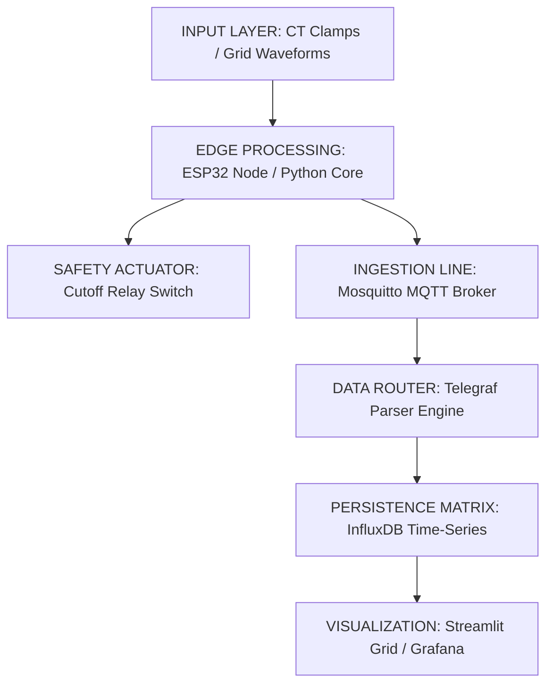

# Smart Home Energy Monitoring System (Industrial IoT Edge Architecture)

An enterprise-grade, end-to-end Industrial IoT (IIoT) edge framework designed to capture, process, route, log, and analyze household and industrial circuit-level electrical telemetry. 

The architecture features an **ESP32 microcontroller edge node** capable of high-frequency waveform processing, which interfaces with a localized, containerized cloud infrastructure stack (**Telegraf, Mosquitto MQTT, InfluxDB, and Grafana**). For testing scenarios where physical hardware components are unavailable, the project includes a concurrent, production-grade **headless Python simulation and web dashboard system** that models complex household load profiles, validates broker routing configurations, logs historical telemetry to disk, and outputs structured analytical PDF reports.

---

## 🏗️ System Architecture & Data Pipeline

The system functions as a localized SCADA (Supervisory Control and Data Acquisition) grid framework mapped across an industry-standard data pipeline.



---

## ✨ System Features
---
* **Asynchronous Edge Signal Ingestion:** Collects and oversamples raw AC grid inputs to prevent analytical line aliasing.
* **True Real-time RMS Processing:** Computes mathematical Root Mean Square conversions across precise 20-cycle mains frequencies to filter out environmental low-level wire line distortions.
* **Automated Network Safety Breaker:** Constantly evaluates live operational current vectors against safe structural limits, instantly tripping an isolation relay and firing off flashing critical MQTT alarm states during overcurrent scenarios.
* **Dual UI Visualization Architectures:** Features both a rolling high-end professional terminal monitoring framework and an interactive **Streamlit Web Dashboard** populated with dynamic Plotly timeseries charts.
* **Automated PDF Analytics Engine:** Compiles captured data clusters directly into standard, executive-ready client energy diagnostic sheets upon system session termination.
* **Dockerized Monitoring Infrastructure:** Runs entirely inside isolated Docker containers, allowing you to deploy the entire analytics backend infrastructure with a single terminal instruction node.

---

## 📂 Project Repository Tree File Layout
---
```text
Smart-Home-Energy-Monitoring-System/
├── firmware/                     # Production Embedded C++ Edge Source
│   ├── src/
│   │   └── main.cpp              # ESP32 Core Controller Firmware
│   └── platformio.ini            # PlatformIO Environment Dependencies File
├── simulation/                   # Headless Simulation & Dashboard Engines
│   ├── main.py                   # High-Fidelity Rich Terminal Telemetry Simulator
│   ├── dashboard.py              # Streamlit Web Application Visual Grid
│   └── requirements.txt          # Python Runtime Ecosystem Dependencies
├── config/                       # Containerized Infrastructure Deployments
│   ├── docker-compose.yml        # Dockerized TIG Stack Automation Orchestrator
│   └── telegraf.conf             # Ingestion Metric Routing Broker Context
├── data/                         # Local Historical CSV Database Dumps [Git Ignored]
├── reports/                      # Compiled Analytics PDF Consumer Files [Git Ignored]
└── README.md                     # Repository Landing Presentation Page
```
---

---
🚀 Deployment & Installation Execution Guide
---
1. Provisioning Virtual Core Simulation Framework
To execute the high-fidelity rolling terminal diagnostic environment simulation, run the following commands sequentially:
```
# Navigate to the simulation environment module
cd simulation

# Enforce core dependency packages setup
pip install -r requirements.txt

# Run the master streaming simulation engine
python main.py
```
---
---
2. Spinning Up the Web Dashboard Layer
To view the interactive graphical control room panels via a web browser frontend layout:
```
# Execute the Streamlit UI application engine node
streamlit run dashboard.py
```
---
---
3. Deploying the Containerized Analytics Stack (Optional Infrastructure)
To deploy the localized database and enterprise visualization telemetry grid backend network:
```
# Enter the deployment configuration root
cd config

# Bring up the Dockerized TIG infrastructure ecosystem
docker-compose up -d
```
---
---